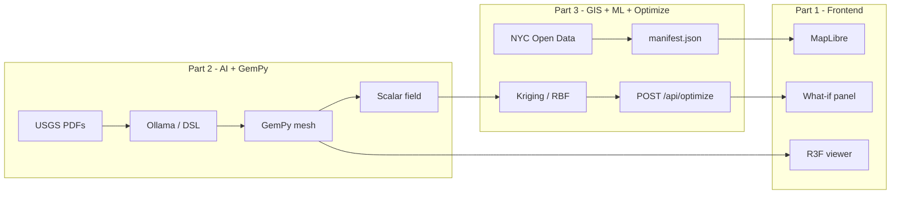

# Urban Subsurface AI: Hackathon Master Blueprint

Part 3 implementation runbook is in `PART3_MEMBER_C.md`.

**Project Objective:** Build a 100% local, edge-computed AI agent that translates dense, unstructured NYC geological PDF reports into an interactive 3D subsurface infrastructure map. This bypasses cloud LLMs entirely, ensuring data privacy, zero latency, and proving the viability of local hardware (M4 architecture) for complex civic data pipelines.

---

## 1. The Core Repository & Frontend Strategy

### 1.1 Starting point: `geo-lm`
Use **[williamjsdavis/geo-lm](https://github.com/williamjsdavis/geo-lm)** as the **canonical starting repository** (MIT license). It already implements the hard parts we need: **PDF upload → document processing → geology DSL → GemPy-oriented 3D workflow**, with a **FastAPI** backend (`api/`), core package (`geo_lm/`), and an upstream **React + Vite** demo UI (`web/`) — **reference only**; our shipped UI is **Next.js on Vercel** (§1.1).

**What we keep from upstream:**
* **REST shape:** document upload/extract, DSL parse/validate/create, workflow status endpoints (see upstream README).
* **DSL pipeline:** structured “geology DSL” as the contract between language understanding and modeling (Lark grammar, validation, retries).
* **Workflow orchestration:** LangGraph-style graphs under `geo_lm/graphs/` for multi-step processing.
* **GemPy integration path:** implicit 3D geological modeling after DSL is stable.

**What we fork / change for this hackathon:**
* **Local inference only:** upstream defaults to cloud providers (Anthropic, OpenAI, Llama API keys in `.env`). Replace the LLM client layer in `geo_lm/ai/` with an **Ollama** adapter that calls `http://localhost:11434` (same prompts, same JSON/DSL targets). Remove or gate cloud keys so the demo narrative stays **edge-local**.
* **NYC corpus:** swap generic `input-data` examples for the **USGS NYC PDFs** listed in §3; tune prompts so the DSL encodes **NYC stratigraphy** (formations, contacts, depths) rather than the repo’s original economic-geology paper.
* **Frontend strategy (locked):** **FastAPI backend stays in the forked `geo-lm` monorepo** (Python, Poetry, Ollama, GemPy, scripts). The **product UI is a separate Next.js application** deployed on **Vercel** — **not** a fork of upstream `web/` (Vite). Use **[geo-lm `web/`](https://github.com/williamjsdavis/geo-lm/tree/main/web)** only as a **feature and UX reference** (document list, workflow status patterns, API client shape, layout ideas); **re-implement** the screens in Next.js (App Router) with MapLibre + React Three Fiber per §2. Wire the Next app to the backend via **`NEXT_PUBLIC_API_BASE_URL`** (local: `http://localhost:8000`; demo: Ngrok/Cloudflare Tunnel URL). CORS must allow the Vercel origin on the FastAPI app.

### 1.2 Reference
* **Backend / modeling repo:** [https://github.com/williamjsdavis/geo-lm](https://github.com/williamjsdavis/geo-lm) (fork → add Ollama, NYC pipeline, GIS scripts, optimize router).
* **Reference UI (read-only patterns):** [https://github.com/williamjsdavis/geo-lm/tree/main/web](https://github.com/williamjsdavis/geo-lm/tree/main/web)
* **Local dev — backend:** `poetry install`, `poetry run uvicorn api.main:app --reload --port 8000`, **Ollama** running on `11434`.
* **Local dev — frontend:** separate repo, `pnpm dev` / `npm run dev` (Next.js), `.env.local` with `NEXT_PUBLIC_API_BASE_URL=http://localhost:8000`.

---

## 2. UI / UX Design Requirements
To win, the presentation of the complex geological data must be instantly digestible.
* **Aesthetic:** Keep it completely minimalistic. Use a clean, white background for the application and easy-to-understand charts. Avoid any dark-mode or "cyberpunk" themes.
* **Geospatial Mapping Layers:** The 2D/3D experience must allow judges to add layers **one by one**. Include toggles for:
    1. Base 2D street map.
    2. GeoJSON polygons representing NYC neighborhood boundaries.
    3. **NYC Open Data contextual layers** (see §6) — flood hazard / infrastructure-related polygons or lines, as static GeoJSON.
    4. **Optional ML-derived rasters or contour overlays** (e.g., smoothed depth-to-bedrock grid) as lightweight GeoJSON isolines or PNG tiles if time permits.
    5. The 3D subsurface wireframes or meshes (the bedrock / formation surfaces generated via GemPy and exported to `.gltf` / `.obj`).
* **Optimization UI:** A small **“What-if”** panel (sliders or numeric inputs) that drives the **toy optimizer** in §8 against **precomputed** or **fast-interpolated** geology fields — never blocking the UI on a full GemPy solve per tick.

---

## 3. Data Acquisition: The Target PDFs
Download these specific public domain USGS reports to feed the local LLM + DSL pipeline. They contain quantitative and interpretive data (stratigraphy, dip, strike, depth, structure).

1. **The Master Stratigraphy:** *Bedrock and Engineering Geologic Maps of Bronx County and parts of New York and Queens Counties (USGS I-2306)*
2. **The Infrastructure Risk Data:** *Newly Mapped Walloomsac Formation in Lower Manhattan and New York Harbor and the Implications for Engineers*
3. **The Depth Metrics:** *Stratigraphy, Structural Geology and Metamorphism of the Inwood Marble Formation, Northern Manhattan (NYC Water Tunnel Data)*

---

## 4. End-to-End Execution Pipeline

### Phase A: Local AI Engine Setup (The Edge Node)
1. Install **Ollama** on your M4 Mac.
2. Pull a high-efficiency quantized model: `ollama run llama3:8b` (or similar modern 8B parameter model). This ensures rapid, offline inference leveraging unified memory.
3. Start the local server (runs on `localhost:11434` by default).
4. **Fork `geo-lm`** and wire `geo_lm/ai/` to Ollama; confirm document → DSL workflow runs with **no cloud API keys**.

### Phase B: Document Ingestion & Extraction (within `geo-lm` patterns)
1. **Dependencies:** follow upstream `pyproject.toml`; ensure **PyMuPDF** (or upstream PDF path), **FastAPI**, **GemPy**, and add **geospatial/ML** libs as needed (see §7): e.g. `geopandas`, `pyproj`, `scipy`, `pykrige` or `gstools`.
2. **PDF ingestion:** use upstream **`/api/documents/upload`** and **`/api/documents/{id}/extract`** (or equivalent) so OCR/text extraction stays consistent with the DSL workflow.
3. **LLM → DSL:** preserve the **geology DSL** as the structured target (not raw JSON only). Use strict prompting + `GEO_LM_MAX_DSL_RETRIES` (or forked equivalent) so invalid DSL is repaired before GemPy.
4. **Optional keyword pre-filter:** retain paragraph/chunk ranking (e.g. “depth”, “schist”, “marble”, “contact”) to reduce tokens sent to Ollama.

### Phase C: Machine Learning — Sparse Data Conditioning (see §7)
Run **after** you have point constraints (from DSL/GemPy inputs or from extracted numeric tables) and **before** or **in parallel with** full implicit modeling:
1. Build a **2D field** (e.g. depth to key horizon) on a regular grid over the **demo AOI** (area of interest), using **Kriging / GP / RBF** with explicit variogram or length-scale choices.
2. Output: **GeoJSON** contours or a small **numpy grid** + world-file or bbox metadata for optional map overlay; feed **representative points** into GemPy if they improve stability.

### Phase D: The 3D Modeling Bridge (GemPy)
1. Parse validated DSL; map entities to `gempy.create_model()` / `init_data()` per upstream conventions.
2. Run interpolation / implicit modeling; export surfaces or volumes to **`.gltf`** or **`.obj`** for the web viewer.
3. Export **scalar fields** (e.g., depth-to-bedrock at grid nodes) for **§8 optimization** — precompute once per pipeline run, reuse for sliders.

### Phase E: Optimization & “What-If” Simulation (see §8)
1. Define a **low-dimensional decision vector** (e.g., borehole depth, lateral offset, or tunnel crown depth).
2. Evaluate **objectives and constraints** using **fast lookups** into the precomputed grid (not a full GemPy re-run per evaluation).
3. Expose results in the UI: optimal value, constraint violations (if any), and **plain-language** interpretation for judges.

### Phase F: Deployment
1. **API:** `uvicorn api.main:app` (or Poetry equivalent) on the demo machine; enable **CORS** for the Vercel deployment origin.
2. **Web:** **Next.js on Vercel** (separate repo); for judges + local GPU narrative, expose FastAPI with **Ngrok** or **Cloudflare Tunnel** and set **`NEXT_PUBLIC_API_BASE_URL`** on Vercel to that public URL (or use a stable preview tunnel).
3. **React Three Fiber** loads the geology **`.gltf`** from the backend URL or from **`public/exports/`** after a copy step (see §10). MapLibre loads **basemap + GeoJSON + Open Data layers** from **`public/layers/`** (checked in or copied from Part 3’s ingest output).

---

## 5. The Winning Pitch
*"City planners waste months manually extracting data from 400-page USGS PDFs to plan geothermal grids and subway expansions. We built Urban Subsurface AI. It uses a 100% local, edge-computed AI agent to read those unstructured reports and instantly generate interactive 3D infrastructure models. No cloud latency, absolute data privacy, and a seamless visual pipeline to build the city of the future safely."*

---

## 6. Geospatial Intelligence — NYC Open Data Integration

### 6.1 Requirements
* **Purpose:** Give **urban risk / infrastructure context** next to interpreted subsurface geology — aligned with hackathon **GIS** and **housing & infrastructure** themes.
* **CRS:** All layers served to the browser as **EPSG:4326 (WGS84)** GeoJSON unless the map library uses another default; reproject in Python with `pyproj` / `geopandas`.
* **Performance / AOI (locked for v1):** The default **demo AOI is three boroughs — Manhattan, Bronx, and Queens**. This matches **USGS I-2306** (“Bronx County and parts of … Queens”) and the Manhattan-focused reports in §3 better than a **Brooklyn**-centric cut. **Implementation complexity is the same** as any other three-borough filter: download [Borough Boundaries](https://data.cityofnewyork.us/City-Government/Borough-Boundaries/gthc-hcne), **filter** `boro_code` / `BoroName` to **Manhattan (1), Bronx (2), Queens (4)**, dissolve/union, then clip/simplify all other layers. **Optional swap:** use **Brooklyn (3) instead of Queens (4)** only if the narrative shifts (e.g. Kings-heavy infrastructure layers); one integer change in the ingest script. **Later:** add Brooklyn or go citywide by widening the filter.
* **Geology vs GIS scope:** With the v1 AOI, **Brooklyn and Staten Island** are **outside** the clipped map unless you extend the filter. **GemPy / DSL** evidence aligns with §3 across **Manhattan, Bronx, and Queens**; label UI copy so judges know the **model** is report-driven.
* **Provenance:** Store **dataset name, download date, and URL** in `static/layers/manifest.json` for attribution in the UI footer.
* **No live Socrata dependency during demo:** Pre-download and version-control **small** GeoJSON artifacts under `static/layers/` (or fetch at build time in CI). Avoid demo failure from API throttling.

### 6.2 Implementation checklist
1. **Layer manifest:** JSON listing `id`, `title`, `type` (`fill` / `line`), `geojson_path`, `opacity`, `legend_color`, `source_url`.
2. **Ingest script:** `scripts/fetch_open_data.py` (or Makefile target) that:
   * Downloads selected City datasets (GeoJSON/Shapefile ZIP from [NYC Open Data](https://opendata.cityofnewyork.us/)).
   * Unzips, reads with GeoPandas, reprojects to WGS84, clips to AOI bbox, simplifies, writes **`public/layers/*.geojson`** in the **Next.js repo** (and/or `data/layers/` in the backend for reproducibility — see §10).
3. **Frontend:** MapLibre `addSource` / `addLayer` per manifest entry; toggles in the layer panel mirror §2.
4. **Backend (optional):** Endpoint `GET /api/layers` returns manifest for dynamic UIs.

### 6.3 Pinned reference layers & starter datasets
**AOI mask (v1: Manhattan + Bronx + Queens — first step in ingest pipeline):**

| Dataset | URL | Role |
|--------|-----|------|
| **Borough Boundaries** (land; five polygons) | [data.cityofnewyork.us/…/Borough-Boundaries/gthc-hcne](https://data.cityofnewyork.us/City-Government/Borough-Boundaries/gthc-hcne) | **Filter** to **BoroCode 1, 2, 4** (Manhattan, Bronx, Queens); dissolve/union; clip/simplify all other layers to this footprint; optional basemap overlay for borough names. |
| **Borough Boundaries (water areas included)** | [data.cityofnewyork.us/…/Borough-Boundaries-water-areas-included-/wh2p-dxnf](https://data.cityofnewyork.us/City-Government/Borough-Boundaries-water-areas-included-/wh2p-dxnf) | Same filter **(1, 2, 4)**; use only if shoreline / harbor geometry matters — usually **heavier** than land-only. |

**Additional layers** — confirm export format and metadata on the portal; clip to the **same three-borough AOI** and add to `manifest.json`:

| Theme | Intent | Notes |
|--------|--------|--------|
| **Flood / storm surge / hydrology-related zones** | Above-ground hazard context vs subsurface excavation risk | Use the **current** FEMA/NYC flood or storm-surge layers the portal exposes; **clip + simplify** to the v1 AOI. |
| **Subsurface infrastructure hints** | Tunnels, large water / transit alignments where publicly available as line/polygon layers | Prefer layers with clear metadata; many are approximate — label as **planning context**, not survey. |
| **Water distribution / subsurface utilities** (if available and usable) | Narrative link to “why geology matters for mains and tunnels” | Often fragmented; include only if geometry is manageable after simplify. |
| **Neighborhood tabulation areas** (optional) | Finer choropleth than boroughs | Heavier geometry; simplify aggressively or skip if borough toggle is enough. |

**“Snapping” honesty:** PDF-derived geology may start **unreferenced**. Phase 1 = **visual overlay** only. Phase 2 (stretch) = manual **bbox** or control points tying one formation outcrop/trace to a line on an Open Data layer.

---

## 7. Machine Learning — Interpolation & Field Smoothing

### 7.1 Requirements
* **Goal:** Turn **sparse, noisy constraints** (from DSL, tables, or manual picks) into a **coherent 2D field** over the AOI so maps and optimization have a continuous surface to sample.
* **Scope (hackathon):** **2D scalar field** only (e.g., **elevation of a key contact** or **depth to bedrock**), not a full learned surrogate of GemPy’s 3D implicit solve.
* **Interpretability:** Document kernel / variogram choice in README; show **uncertainty** if the library exposes it (Kriging variance) — optional contour or hatch for “high variance” regions.

### 7.2 Implementation options (pick one primary)
1. **Ordinary Kriging:** `PyKrige` on scattered `(x, y, z)` points → regular grid → export contours as GeoJSON via `matplotlib` contourf → `shapely` polygonize (or manual contour lines).
2. **Gaussian Process / RBF:** `sklearn.gaussian_process` or `scipy.interpolate.RBFInterpolator` for rapid prototyping when variogram fitting is finicky.
3. **GSTools:** variogram analysis + Kriging with clearer geostat narrative for judges.

### 7.3 Pipeline integration
* **Input points:** From validated DSL (e.g., contacts with approximate XY if georeferenced; else use **synthetic XY** along a 1D profile for demo-only, clearly labeled).
* **Output:** NumPy grid + bbox → **pickle or `.npz`** in `data/fields/`; **GeoJSON** isolines for the map; optional **CSV** sample for the optimizer in §8.
* **Feasibility guard:** If fewer than **N** valid points, skip Kriging and show a **“insufficient data”** banner; do not fabricate a pretty but meaningless surface.

---

## 8. Optimization & Simulation — Infrastructure “What-If”

### 8.1 Requirements
* **Goal:** Demonstrate **decision support** for **urban infrastructure** (geothermal borefield **or** shallow tunnel / utility corridor) using **optimization under simple constraints** — aligned with hackathon **optimization and simulation**.
* **Hard rule:** The objective function **must not invoke GemPy** per slider tick. Use **precomputed** scalar fields from §7/§4D or **cheap interpolators**.
* **Transparency:** Show **constraints** (e.g., minimum rock cover, maximum grade, depth bounds) and **numeric optimum** in the UI.

### 8.2 Mathematical sketch (customize per demo)
* **Decision variables:** Example — `d` = bore depth (m) or tunnel crown depth; optional 2D: `(east, north)` offset along a corridor polyline.
* **Objective:** e.g. minimize `C(d) = c1 * drilling_length + c2 * risk_proxy(d)` where `risk_proxy` comes from **distance to flood zone**, **shallow bedrock** (from ML field), or **weak formation** thickness read from the grid.
* **Constraints:** `d_min ≤ d ≤ d_max`; `gradient ≤ g_max` along corridor; optional **avoid polygon** (protected zone) as penalty or hard constraint.
* **Solver:** `scipy.optimize.minimize` (SLSQP or L-BFGS-B for bounds) or **brute grid search** over 1D `d` for demo reliability.

### 8.3 Implementation checklist
1. **Precompute:** After each full pipeline run, write `data/fields/cost_raster_meta.json` (bbox, resolution, CRS) + `cost_grid.npz` (or reuse depth grid from §7).
2. **API:** `POST /api/optimize` with JSON body `{ "mode": "geothermal" | "tunnel", "params": { ... } }` returns `{ "optimal_d": ..., "objective": ..., "constraints_ok": true/false }`.
3. **UI:** Sliders bound to API calls with **debounce**; display **spinner** only if optimization exceeds ~200ms.

---

## 9. Team Workstreams (3-Person Split)

The work is divided into three **independently buildable** parts so each member owns a clear surface and can develop in **parallel** with mocks until integration. Each part below lists **scope, owned files/endpoints, deliverables, dependencies on other parts, and mocks** to use while waiting on a teammate.

### Part 1 — Frontend (Member A)
**Owns:** the entire user-facing app as a **separate Next.js repository** deployed on **Vercel**, plus **all UI/UX from §2**. **No Python.** Treat **[geo-lm `web/`](https://github.com/williamjsdavis/geo-lm/tree/main/web)** as a **catalog of features to re-build**, not code to copy: e.g. document listing, upload/progress patterns, API client conventions, page structure — then implement in **Next.js** (App Router, TypeScript) with your own components.

* **Scope**
  * App shell: minimalist white theme, layout (top bar + left sidebar + main stage + bottom strip per §2).
  * **Map (2D):** MapLibre (or Mapbox-compatible) with **basemap**, **three-borough outline** (Manhattan, Bronx, Queens), and **NYC Open Data layers** from `public/layers/manifest.json` (produced by Part 3).
  * **3D viewer:** React Three Fiber loading `.gltf` from **`public/exports/`** or from a URL returned by **`POST /api/run`** (Part 2).
  * **Layer panel:** toggles, opacity, legend rendered from `manifest.json`.
  * **What-if panel:** sliders/inputs calling **`${NEXT_PUBLIC_API_BASE_URL}/api/optimize`** (Part 3), with debounce, loading state, constraint readouts.
  * **About / provenance footer:** dataset names, USGS report citations, attribution strings.
  * **Env:** `NEXT_PUBLIC_API_BASE_URL` for all backend calls; never hardcode tunnel URLs in source (use Vercel env vars).
* **Owned files (typical) — Next repo root**
  * `src/components/MapView.tsx`, `SubsurfaceViewer.tsx`, `LayerPanel.tsx`, `WhatIfPanel.tsx`, `src/lib/api.ts`, `app/layout.tsx`, `app/page.tsx`.
  * `public/layers/manifest.json` (stub → replaced by Part 3 output), `public/layers/*.geojson`, `public/exports/*.gltf`.
* **Deliverables**
  1. **Vercel project** green; app boots with **basemap + AOI outline** from stub `manifest.json` + sample `.gltf` in `public/`.
  2. Layer panel drives MapLibre from manifest; toggles work.
  3. 3D viewer loads mesh; orbit/pan/reset.
  4. What-if panel works with **mock** responses locally and **live** `/api/optimize` when tunnel + env are set.
  5. Polished, minimal UI per §2; no dark mode; mobile is **not** a priority.
* **Dependencies on others**
  * Part 2: **`.gltf`** URL or file + **`POST /api/run`** response shape (§10).
  * Part 3: **`manifest.json`** + GeoJSON in `public/layers/` (or served via **`GET /api/layers`**); **`/api/optimize`** on the backend.
* **Mocks while waiting**
  * `public/layers/manifest.json` — stub borough + fake flood polygon.
  * `public/exports/sample.gltf` — small demo mesh.
  * **Mock optimizer** in `api.ts` when `NEXT_PUBLIC_API_BASE_URL` is empty or a `?mock=1` flag.

### Part 2 — AI Extraction & 3D Modeling Backbone (Member B)
**Owns:** the **forked `geo-lm` core**: local LLM, document/DSL pipeline, GemPy modeling, mesh export, and the “core” FastAPI endpoints already in upstream.

* **Scope**
  * **Fork & local-only inference:** replace cloud LLM clients in `geo_lm/ai/` with an **Ollama** adapter (per §1.1, §4 Phase A). Verify the **DSL workflow** runs **without** Anthropic/OpenAI/Llama API keys.
  * **NYC PDF ingestion:** wire the three USGS PDFs from §3 through `/api/documents/upload` + `/api/documents/{id}/extract`; tune prompts so DSL captures formations, contacts, depths, dip.
  * **DSL → GemPy:** parse validated DSL (Lark grammar from upstream), build the model, run interpolation, and **export the surfaces/volume to `.gltf`** (preferred) or `.obj`.
  * **Scalar field export for downstream parts:** after each full run, dump a **2D depth-to-bedrock grid** (or other key horizon) plus metadata so Part 3 (ML/optimizer) can consume it.
  * **`POST /api/run`** (or extend upstream `/api/workflows/{document_id}/process`) to orchestrate ingestion → DSL → GemPy → exports as one button.
* **Owned files (typical)**
  * `geo_lm/ai/ollama_client.py` (new), updates to `geo_lm/ai/__init__.py` provider selection.
  * `geo_lm/graphs/` (LangGraph nodes for the NYC pipeline).
  * `geo_lm/modeling/gempy_runner.py` (new) for DSL → GemPy → mesh.
  * `api/routers/runs.py` (new) for `/api/run` and run status.
  * `data/exports/{run_id}.gltf`, `data/fields/depth.npz`, `data/fields/depth_meta.json` — outputs.
* **Deliverables**
  1. **One-command local demo** (e.g. `make run-demo` or a script) that ingests one USGS PDF and writes a deterministic `.gltf` to `data/exports/`.
  2. DSL workflow stable on the three §3 PDFs (with retries).
  3. **Scalar field export** present after each run, in the agreed schema (see §10).
  4. `/api/run` triggers the pipeline and returns the **paths** to the produced `.gltf` + field files.
* **Dependencies on others**
  * Part 1 needs to know the **`.gltf` path convention** (see §10).
  * Part 3 consumes the **scalar field** for ML + optimizer — Part 2 must publish the grid + meta JSON in the agreed shape.
* **Mocks while waiting**
  * If Ollama integration is slow, keep a **synthetic DSL** snapshot under `tests/fixtures/` and run GemPy on that to exercise the export path end-to-end.
  * Provide a **stub** `data/fields/depth.npz` from a smooth analytic surface so Part 3 can develop the ML/optimizer immediately.

### Part 3 — GIS Open Data, ML Field, Optimization API (Member C)
**Owns:** every **spatial/analytical** layer that augments the geology model — **NYC Open Data ingest**, **layer manifest service**, **Kriging / interpolation** of the 2D field, and the **`/api/optimize`** endpoint.

* **Scope**
  * **Open Data ingestion (§6):** `scripts/fetch_open_data.py` filters [Borough Boundaries](https://data.cityofnewyork.us/City-Government/Borough-Boundaries/gthc-hcne) to **BoroCode 1, 2, 4** (Manhattan, Bronx, Queens), dissolves to one AOI multipolygon, and clips/simplifies the additional themed layers (flood, infrastructure-context). Writes GeoJSON + **`manifest.json`** to **`data/layers/`** in the backend repo (committed or gitignored per team policy) and documents a **one-step copy** into the Next repo’s **`public/layers/`** for static hosting (or rely on `GET /api/layers` + base64/URL — prefer file copy for hackathon simplicity).
  * **Layer service (optional):** `GET /api/layers` returns the same manifest dynamically (helpful if hosting layers behind the API tunnel rather than from frontend static).
  * **ML / interpolation (§7):** consume Part 2’s `data/fields/depth.npz` (or scattered points from DSL) and produce a **smoothed grid + GeoJSON contours** under `data/layers/depth_contours.geojson` (then sync to Next **`public/layers/`**). Use **PyKrige / GSTools / RBF**; document kernel and any uncertainty output.
  * **Optimization API (§8):** `POST /api/optimize` reading the precomputed grid (no GemPy at runtime), running `scipy.optimize` or a grid search over the chosen decision variables, and returning a clear JSON payload.
  * **Provenance:** keep dataset name + URL + download date in `manifest.json` for the UI footer.
* **Owned files (typical)**
  * `scripts/fetch_open_data.py`, `scripts/build_field.py`, optional `scripts/sync_layers_to_frontend.sh` (copies `data/layers/*` → Next `public/layers/`).
  * `api/routers/layers.py`, `api/routers/optimize.py` (new).
  * `data/layers/*.geojson`, `data/layers/manifest.json` (backend); mirrored under **`public/layers/`** in the Vercel repo after sync.
* **Deliverables**
  1. Three-borough AOI mask + at least **one** additional Open Data layer (flood is highest priority) clipped, simplified, and visible in Part 1’s UI.
  2. ML grid + contours produced from a real or stub depth field.
  3. `POST /api/optimize` returns sensible numbers under demo constraints in **<200 ms**.
  4. `manifest.json` with provenance complete enough to drive the UI legend and footer attribution.
* **Dependencies on others**
  * Part 2 publishes the **scalar field**; Part 3 can start against a **stub field** (analytic surface) while waiting.
  * Part 1 consumes **manifest.json** and calls `/api/optimize`.
* **Mocks while waiting**
  * Hardcoded depth field from a Gaussian bump or linear gradient until Part 2 ships real GemPy output.
  * A static `manifest.json` exposing only Borough Boundaries + a single test polygon, expanded as more datasets land.

### Workstream Dependency Graph (mermaid)

---

## 10. Integration Guide

This section is the **single source of truth** for how the three parts come together. Lock the contracts here **before** branching off, and treat any change as a team-wide decision.

### 10.1 Repository layout
* **Two repos (locked):**
  1. **Backend:** fork of `geo-lm` — Python, FastAPI, Ollama, GemPy, `scripts/`, `data/exports/`, `data/fields/`, `data/layers/`. Parts **2 and 3** PR here (Part 3 owns routers + ingest under this repo).
  2. **Frontend:** new **Next.js** repo — Vercel deploy, `public/layers/`, `public/exports/`, MapLibre + R3F. Part **1** PRs here only.
* **Branches (each repo):** `feat/ai-pipeline`, `feat/gis-ml-optim`, `feat/frontend` → merge to `main` daily. **Contract freeze:** any change to §10.3–10.4 is announced in team chat before merge.
* **geo-lm `web/`:** reference only; do not treat as a package dependency.

### 10.2 Shared file layout (canonical paths)
* **Backend repo:** `data/exports/{run_id}.gltf` — Part 2 writes; expose via FastAPI static mount **or** copy to Next `public/exports/` for same-origin loading.
* **Backend repo:** `data/fields/depth.npz` + `data/fields/depth_meta.json` — Part 2 writes, Part 3 reads.
* **Backend repo:** `data/layers/*.geojson` + `data/layers/manifest.json` — Part 3 writes; **sync** to **Next repo** `public/layers/` before Vercel build (or CI artifact step).
* **Frontend repo:** `public/layers/*`, `public/exports/*.gltf` — what Part 1 actually serves; keep in sync with backend outputs for the demo tag you show judges.

### 10.3 API contracts (freeze early)
* **`POST /api/run`** (Part 2)
  * Request: `{ "document_id": "..." }` (or omit to use cached USGS bundle).
  * Response: `{ "run_id": "...", "gltf_path": "/static/exports/...gltf", "depth_field_path": "data/fields/depth.npz", "status": "ok" }`.
* **`GET /api/layers`** (Part 3, optional if served statically)
  * Response: `{ "layers": [ { "id": "boroughs", "title": "Boroughs", "type": "fill", "geojson_path": "/layers/boroughs.geojson", "opacity": 0.4, "legend_color": "#888", "source_url": "..." }, ... ] }`.
* **`POST /api/optimize`** (Part 3)
  * Request: `{ "mode": "geothermal" | "tunnel", "params": { "d_min": 5, "d_max": 60, ... } }`.
  * Response: `{ "optimal_d": 24.3, "objective": 1.27, "constraints_ok": true, "diagnostics": { ... } }`.

### 10.4 Field grid schema
* `depth.npz` keys: `grid` (`float32[H, W]`), `mask` (`uint8[H, W]`, optional), `x` (`float32[W]`), `y` (`float32[H]`).
* `depth_meta.json`: `{ "crs": "EPSG:4326", "bbox": [minx, miny, maxx, maxy], "resolution_m": 50, "units": "meters_below_surface", "source": "gempy" | "kriging_only" | "stub" }`.

### 10.5 CRS and units
* All **frontend GeoJSON** in **EPSG:4326**.
* All **server-side simplification, kriging, and distance constraints** done in a **projected CRS** (suggested **EPSG:6539 — NAD83(2011) / New York Long Island (ftUS)** or **EPSG:32618 / UTM 18N**), then reprojected to 4326 on the way out.
* Pick **one** projected CRS and document it in `depth_meta.json` so optimization distances are consistent.

### 10.6 Local dev workflow
* **Every member runs Ollama locally** (or points to one shared M4 over LAN) — required even for Parts 1 and 3 if they want true E2E smoke tests.
* **Run order for a clean E2E:**
  1. Part 3: `python scripts/fetch_open_data.py` → writes `data/layers/` → run **`scripts/sync_layers_to_frontend.sh`** (or manual copy) → Next `public/layers/`.
  2. Part 2: `make run-demo` → `data/exports/*.gltf` + `data/fields/depth.npz`; copy **`.gltf`** to Next `public/exports/` if not serving from FastAPI static.
  3. Part 3: `python scripts/build_field.py` → contours; verify **`POST /api/optimize`** against the grid.
  4. Part 1: `next dev` with `NEXT_PUBLIC_API_BASE_URL` pointing at local FastAPI **or** tunnel URL.

### 10.7 Demo run-of-show (M4 Pro, ~24 GB)
1. **Pre-warm:** start Ollama, run pipeline once before doors open so `.gltf` + grids are cached.
2. **Live story:** open UI → toggle layers in §2 order → click a borough → load 3D mesh → run **what-if** slider → narrate optimization output and constraints.
3. **Tunnel:** if frontend is hosted on Vercel, expose FastAPI via **Cloudflare Tunnel** or **Ngrok**; keep the URL pinned so Part 1 can hit it without code changes.

### 10.8 Verification milestones
* **M1 — Skeleton (Day 1):** Part 1 boots with stub manifest + sample mesh; Part 2 boots Ollama + a trivial DSL; Part 3 fetches Borough Boundaries and writes manifest.
* **M2 — Real exports (Day 2):** Part 2 produces a real `.gltf` from one USGS PDF; Part 3 builds a Kriging grid (real or stub points) and serves `/api/optimize`.
* **M3 — Wire-up (Day 3):** All three parts consume each other’s real outputs; UI shows the real mesh + real layers + real optimizer.
* **M4 — Polish (final day):** UI states, error toasts, loading skeletons, attribution footer; smoke run-of-show twice.

### 10.9 Risks & fallbacks
* **DSL flakiness on long PDFs:** Part 2 keeps a **fixture DSL** that always renders to a known mesh; if the live LLM run fails on stage, switch to fixture path silently.
* **Open Data layer too heavy:** drop to AOI mask only; rely on geology mesh for the “wow.”
* **Optimization stalls:** swap solver to **brute grid search** over the 1D variable; always finishes in <50 ms for demo.

---

## 11. Deferred / Out of Scope (for this blueprint revision)
* Computer vision plate extraction and ONNX/QNN deployment paths (optional future).
* Full **3D surrogate model** of GemPy (requires large training corpus).
* Live AR/VR — narrative only unless time permits.

---

## 12. License & Attribution
* **geo-lm:** MIT — preserve license and attribution when forking.
* **NYC Open Data:** Per-dataset terms and attribution strings in the layer manifest and UI.
* **USGS reports:** Public-domain geology sources; cite map/report numbers in the app **About** panel.
