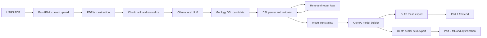

# Part 2 Design: Local AI Extraction and 3D Modeling Backbone

## Owner
Member B owns Part 2: the local LLM + document extraction + geology DSL + GemPy mesh export backbone.

This workstream is the backend core that makes the demo real. It starts from the `geo-lm` architecture, replaces cloud LLM inference with local Ollama, processes NYC geology PDFs, validates structured geology output, produces a GemPy-compatible model, and writes artifacts that the frontend and Part 3 can consume.

## Mission
Build a local-only backend pipeline that converts NYC geologic reports into:

1. Validated geology DSL or equivalent structured geology constraints.
2. A reproducible 3D geology mesh export (`.gltf` preferred).
3. A scalar 2D field export (`depth.npz` + `depth_meta.json`) for Part 3 ML and optimization.
4. FastAPI endpoints that allow the frontend to trigger and inspect runs.

## Non-Goals
Part 2 does not own:

1. The Next.js/Vercel frontend.
2. NYC Open Data ingestion, layer manifests, or map styling.
3. Kriging/RBF smoothing and optimization math, except for exporting the raw field inputs Part 3 needs.
4. Computer vision/OCR plate extraction in the first implementation.
5. A production-grade geological interpretation engine. The goal is a credible hackathon-grade pipeline with honest fallbacks.

## Starting Assumptions
The current `geo-nyc` repo only contains the project blueprint. The backend implementation should be based on a fork or copy of `williamjsdavis/geo-lm`, then adapted locally.

Target runtime:

1. macOS on M4 Pro with 24 GB unified memory.
2. Python virtual environment inside the backend repo.
3. Ollama local server at `http://localhost:11434`.
4. Default model: configurable 8B-class model, initially `llama3.1:8b` or `llama3:8b`.
5. FastAPI on `localhost:8000`.

## High-Level Architecture



## Component Design

### 1. Backend Application Shell
Use the upstream `geo-lm` FastAPI app shape if available:

```text
api/
  main.py
  routers/
    documents.py
    dsl.py
    workflows.py
    runs.py
geo_lm/
  ai/
  parsers/
  graphs/
  modeling/
  domain/
data/
  documents/
  runs/
  exports/
  fields/
  fixtures/
```

If the forked code is not yet present, create the structure incrementally. Do not block on perfect upstream parity; keep public contracts stable.

### 2. Local LLM Provider
Introduce an `OllamaClient` behind the same kind of provider abstraction used by `geo-lm`.

Responsibilities:

1. Call `POST /api/chat` or `POST /api/generate` on `localhost:11434`.
2. Read model and tuning settings from environment variables.
3. Support deterministic-ish runs for demo reproducibility.
4. Surface timeouts, invalid responses, and retryable errors clearly.
5. Never require cloud API keys for the demo path.

Recommended config:

```text
GEO_NYC_LLM_PROVIDER=ollama
GEO_NYC_OLLAMA_BASE_URL=http://localhost:11434
GEO_NYC_OLLAMA_MODEL=llama3.1:8b
GEO_NYC_OLLAMA_TEMPERATURE=0.1
GEO_NYC_OLLAMA_NUM_CTX=8192
GEO_NYC_LLM_TIMEOUT_SECONDS=180
GEO_NYC_MAX_DSL_RETRIES=4
```

Use low temperature because the output must be structured and validated.

### 3. Document Ingestion
Use the existing `geo-lm` document endpoints where possible:

1. `POST /api/documents/upload`
2. `POST /api/documents/{id}/extract`
3. `POST /api/workflows/{document_id}/process`

If the upstream API is changed, keep adapter routes with these names or document the replacement in `README.md`.

Document storage:

```text
data/documents/
  raw/
    {document_id}.pdf
  extracted/
    {document_id}.txt
    {document_id}.json
```

Extraction output should preserve:

1. Page number.
2. Text chunk.
3. Source document name.
4. Extraction method (`pymupdf_text`, `ocr_future`, `manual_fixture`).
5. Character offsets when available.

### 4. Chunking and Relevance Ranking
The local LLM should not receive entire 400-page reports at once. Add a chunking layer before prompting.

Chunk object:

```json
{
  "chunk_id": "doc123-p004-c02",
  "document_id": "doc123",
  "page_start": 4,
  "page_end": 5,
  "text": "...",
  "score": 0.82,
  "keywords": ["depth", "Inwood Marble", "contact"]
}
```

Ranking signals:

1. Keywords: `depth`, `bedrock`, `formation`, `contact`, `schist`, `marble`, `gneiss`, `strike`, `dip`, `tunnel`, `boring`, `Manhattan`, `Bronx`, `Queens`.
2. Numeric patterns: values followed by `ft`, `feet`, `m`, `meters`, `Ma`, angle symbols, `dip`.
3. Formation names from the NYC glossary.
4. Tables or lists with repeated depth-like numbers.

The first version can be keyword + regex based. Save scores so low-evidence regions can be explained later.

### 5. Prompt and Structured Output Strategy
Keep the upstream geology DSL as the preferred contract. If direct DSL generation is too brittle, use an intermediate JSON extraction and then convert JSON to DSL locally.

Recommended two-stage strategy:

1. **Extraction JSON:** ask Ollama for strict JSON constraints from chunks.
2. **DSL builder:** deterministic Python converts accepted constraints to DSL.
3. **DSL validator:** existing parser validates the final DSL.

This is usually more reliable than asking the model to write grammar-perfect DSL directly.

Extraction JSON schema:

```json
{
  "formations": [
    {
      "name": "Inwood Marble",
      "rock_type": "metamorphic",
      "aliases": ["Inwood marble"],
      "evidence": [
        {
          "document_id": "inwood-report",
          "page": 12,
          "quote": "..."
        }
      ]
    }
  ],
  "contacts": [
    {
      "top_formation": "Manhattan Schist",
      "bottom_formation": "Inwood Marble",
      "depth_value": 42.0,
      "depth_unit": "m",
      "location_text": "northern Manhattan",
      "confidence": 0.72,
      "evidence": []
    }
  ],
  "structures": [
    {
      "type": "dip",
      "value_degrees": 35,
      "formation": "Manhattan Schist",
      "location_text": "Bronx",
      "evidence": []
    }
  ]
}
```

Minimum accepted fields for a demo run:

1. At least two named formations.
2. At least one contact or depth relationship.
3. At least one evidence quote.
4. Units normalized to meters.

### 6. Validation and Repair Loop
Every LLM output goes through validation. Never pass raw model output directly into GemPy.

Validation layers:

1. JSON parse or DSL parse.
2. Schema validation with Pydantic.
3. Unit normalization.
4. Formation alias normalization.
5. Sanity checks:
   - Depth values must be finite.
   - Top depth <= bottom depth when both exist.
   - Dip angles in `[0, 90]`.
   - Required evidence references must exist.
6. DSL grammar validation.

Repair loop:

1. If JSON/DSL invalid, pass validation errors and the original output back to Ollama.
2. Max retries: `GEO_NYC_MAX_DSL_RETRIES`.
3. If still invalid, write failed output under `data/runs/{run_id}/failed_llm_output.txt`.
4. Fall back to fixture DSL for demo if configured.

### 7. Domain Normalization
Add a small NYC geology glossary:

```text
Manhattan Schist
Inwood Marble
Fordham Gneiss
Walloomsac Formation
Hartland Formation
Ravenswood Granodiorite
```

Use it to normalize spelling, aliases, and rock type.

First implementation can be a YAML or JSON file:

```text
data/fixtures/nyc_geology_glossary.json
```

### 8. GemPy Model Builder
Create a `gempy_runner` module that transforms validated constraints into a small, deterministic model.

First-pass rules:

1. Use a bounded AOI for Manhattan + Bronx + Queens.
2. Use coarse grid resolution for demo stability.
3. Use a fixture or synthesized set of surface points if the extracted text lacks enough georeferenced points.
4. Store whether each point is extracted, inferred, or fixture-derived.

Output directory:

```text
data/runs/{run_id}/
  extraction.json
  geology.dsl
  validation_report.json
  gempy_inputs.json
  run_manifest.json
data/exports/
  {run_id}.gltf
data/fields/
  depth.npz
  depth_meta.json
```

### 9. Mesh Export
Preferred output for Part 1:

```text
data/exports/{run_id}.gltf
```

Requirements:

1. Mesh must load in React Three Fiber.
2. Use reasonable scale and orientation.
3. Include material names or object names by formation where possible.
4. Keep file size demo-friendly.
5. Provide a stable `sample.gltf` fallback.

If GemPy export to glTF is awkward:

1. Export vertices/faces with `trimesh`.
2. Build a simple formation surface mesh manually.
3. Export `.glb` or `.gltf`.

The demo cares about visible, credible 3D subsurface surfaces more than perfect geology.

### 10. Scalar Field Export
Part 3 needs a simple field, not a GemPy internals object.

`depth.npz` keys:

```text
grid: float32[H, W]
mask: uint8[H, W], optional
x: float32[W]
y: float32[H]
```

`depth_meta.json`:

```json
{
  "crs": "EPSG:4326",
  "projected_crs": "EPSG:32618",
  "bbox": [-74.05, 40.48, -73.70, 40.93],
  "resolution_m": 100,
  "units": "meters_below_surface",
  "source": "gempy",
  "run_id": "demo-001"
}
```

If the real field is not ready, export a deterministic stub field with `"source": "stub"` so Part 3 can proceed.

### 11. Run Orchestration
Add one high-level runner so the demo can be launched without clicking through all individual endpoints.

API endpoint:

```http
POST /api/run
```

Request:

```json
{
  "document_ids": ["doc1", "doc2"],
  "use_cached": true,
  "allow_fixture_fallback": true
}
```

Response:

```json
{
  "run_id": "2026-04-26-demo-001",
  "status": "ok",
  "gltf_path": "/static/exports/2026-04-26-demo-001.gltf",
  "depth_field_path": "data/fields/depth.npz",
  "depth_meta_path": "data/fields/depth_meta.json",
  "dsl_path": "data/runs/2026-04-26-demo-001/geology.dsl",
  "warnings": []
}
```

Status endpoint:

```http
GET /api/run/{run_id}
```

Return status, progress stage, artifact paths, warnings, and errors.

### 12. Static File Serving
FastAPI should mount exports for the frontend:

```text
/static/exports/{run_id}.gltf
/static/runs/{run_id}/run_manifest.json
```

Do not serve raw PDFs publicly unless needed.

### 13. Manual Setup Responsibilities
Member B must set up:

1. Homebrew, if missing.
2. Python 3.11 or 3.12.
3. Local virtual environment in backend repo.
4. Ollama install and model pull.
5. USGS PDFs downloaded into `data/documents/raw/`.
6. `.env` or `.env.local` for backend config.
7. FastAPI dev server.
8. Fixture run that works offline before attempting real PDFs.

The exact commands live in `part-2-requirements.md`.

### 14. Reliability Strategy
Because this is a hackathon demo, reliability beats perfect automation.

Required fallbacks:

1. Fixture DSL that always builds a model.
2. Sample `.gltf` checked into a known path or generated by script.
3. Stub `depth.npz` if GemPy field export is not ready.
4. Cached successful run folder for demo day.
5. Clear warnings in API response when fallback data is used.

### 15. Security and Privacy
Local-only demo requirements:

1. No cloud LLM API calls.
2. No Anthropic/OpenAI keys required.
3. Do not commit `.env`.
4. Do not commit large PDFs unless the team explicitly decides to.
5. CORS only allows local frontend and Vercel frontend origins.
6. Tunnel URL should be temporary and not treated as authentication.

### 16. Performance Targets
For M4 Pro / 24 GB:

1. Ollama 8B quantized model should run comfortably for chunked prompts.
2. Use chunking to avoid huge context windows.
3. Target full cached demo run in under 60 seconds.
4. Target fresh single-PDF extraction + model generation in under 5 minutes.
5. Target mesh size under 25 MB for frontend comfort.
6. Target field grid around 100 m resolution initially; refine only if stable.

### 17. Test Strategy
Tests should cover:

1. Ollama client request/response parsing with mocked HTTP.
2. Chunk ranking deterministic behavior.
3. Extraction JSON schema validation.
4. DSL generation and parser validation.
5. Unit normalization.
6. GemPy runner smoke test using fixture constraints.
7. Mesh export file exists and is non-empty.
8. Field export schema keys and metadata.
9. `/api/run` happy path with fixture mode.
10. `/api/run` invalid document handling.

### 18. Handoff Contract
Part 2 must provide Part 1 and Part 3:

1. A stable `/api/run` response schema.
2. A stable static export path for `.gltf`.
3. `data/fields/depth.npz`.
4. `data/fields/depth_meta.json`.
5. A `run_manifest.json` with source, warnings, fallback status, and artifact paths.

Handoff should work even if the underlying geology is fixture-backed.

## Design Decisions Locked
1. Use Ollama first, not direct `llama.cpp`.
2. Keep model name configurable.
3. Prefer JSON extraction followed by deterministic DSL generation over direct raw DSL generation.
4. Preserve `geo-lm` backend concepts where practical.
5. Export files, not in-memory objects, as integration boundaries.
6. Always keep fixture fallback.

## Open Decisions
These can be decided during implementation:

1. Exact model: `llama3.1:8b`, `llama3:8b`, `mistral`, or another Ollama model.
2. Whether first demo uses one PDF or all three PDFs.
3. Exact GemPy grid bounds and resolution.
4. Whether the exported 3D asset is `.gltf` or `.glb`.
5. Whether to expose static files through FastAPI or copy them into the Next.js repo before demo.
